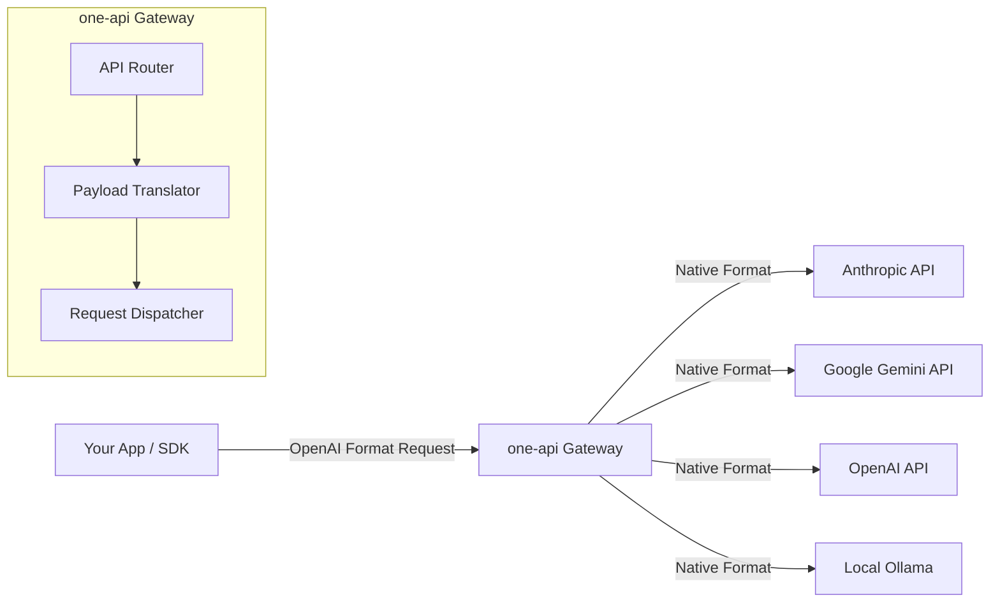

<div align="center">
  
  
  <br/>

  <h1>🌌 one-api</h1>
  <p><b>Universal Edge LLM Gateway</b></p>
  <i>One API to rule them all. Unify OpenAI, Anthropic, Google, DeepSeek, and more behind a single endpoint.</i>

  <br/>
  
  [](https://nodejs.org)
  [](https://docker.com)
  [](LICENSE)
</div>

---

## 📑 Table of Contents
- [✨ What is this?](#-what-is-this)
- [📈 Enterprise Features](#-enterprise-features)
- [🧠 Supported Providers](#-supported-providers)
- [🏗️ System Architecture](#️-system-architecture)
- [🚀 Quick Start](#-quick-start)
- [📦 Docker Deployment](#-docker-deployment)
- [⚙️ Advanced Configuration](#️-advanced-configuration)
- [🛠️ Development](#️-development)

---

## ✨ What is this?

A dead-simple, single-binary gateway that turns **dozens of LLM providers** into one clean, standard OpenAI-compatible API.  

Run it once and forget about provider differences. Keys, specific models, differing endpoints, and prompt formatting are all abstracted entirely away from your client code.

**Why?** Because juggling multiple SDKs, streaming formats, and API structures is a massive pain when trying to switch models mid-development. This just works.

---

## 📈 Enterprise Features

- **Zero Config**: Starts instantly, works out of the box, and stays up.
- **Single Binary**: No complex dependencies, just run it natively or via Docker.
- **100% OpenAI-Compatible**: Your existing code, libraries, and SDKs (like `openai-node` or `langchain`) work completely unchanged. Just swap the `baseURL`.
- **Lightweight & Fast**: No bloated admin UIs. Features automatic response compression for reduced bandwidth and drastically lower latency.
- **Streaming Support**: Flawlessly streams Server-Sent Events (SSE) across all supported providers natively.
- **Free & Open Source**: MIT licensed forever, no hidden SaaS tiers.

---

## 🧠 Supported Providers

You can route requests seamlessly to any of these providers using the exact same `/v1/chat/completions` payload format:

- **OpenAI** (GPT-4o, GPT-3.5)
- **Anthropic Claude** (Opus, Sonnet, Haiku)
- **Google Gemini** (Gemini 1.5 Pro/Flash)
- **Azure OpenAI**
- **DeepSeek**
- **Groq** (Llama 3, Mixtral)
- **Together AI**
- **Mistral AI**
- **Local inference** (Ollama, LM Studio)
- *+20 more API-compatible providers...*

---

## 🏗️ System Architecture



---

## 🚀 Quick Start

### 1. Clone & Install
```bash
git clone https://github.com/shenald-dev/one-api
cd one-api
npm install
```

### 2. Configure Environment
```bash
cp .env.example .env
# Open .env and add your provider API keys
```

### 3. Run the Server
```bash
npm start
```

### 4. Test the Endpoint
Point any curl command or SDK to `http://localhost:3000/v1`:
```bash
curl -H "Content-Type: application/json" \
     -d '{"model":"claude-3-haiku-20240307","messages":[{"role":"user","content":"Hello!"}]}' \
     http://localhost:3000/v1/chat/completions
```
*Notice how you passed an Anthropic model to an OpenAI-compatible endpoint!*

---

## 📦 Docker Deployment (Recommended)

The most robust way to run `one-api` in production:

```bash
docker run -d \
  -p 3000:3000 \
  -v $(pwd)/data:/app/data \
  -e OPENAI_API_KEY=sk-... \
  -e ANTHROPIC_API_KEY=sk-... \
  shenald/one-api:latest
```

---

## ⚙️ Advanced Configuration

All routing is controlled via environment variables in the `.env` file:

```bash
# Server Configuration
PORT=3000
ENABLE_COMPRESSION=true

# Provider Keys
OPENAI_API_KEY=sk-...
ANTHROPIC_API_KEY=sk-...
GOOGLE_API_KEY=...
DEEPSEEK_API_KEY=...
GROQ_API_KEY=...
OLLAMA_BASE_URL=http://localhost:11434
```

No databases required. No migrations. State is entirely managed via configuration.

---

## 🛠️ Development

Want to add a new provider adapter?
```bash
# Install deps
npm install

# Run dev with hot reload
npm run dev

# Run the test suite
npm test

# Build Docker image locally
docker build -t shenald/one-api .
```

---

## 🙋‍♂️ About

Built by a vibe coder who got tired of rewriting API integrations.  
If it's useful, star it ⭐ — if not, open an issue and tell me why.

**Keep it simple.** 🧘
